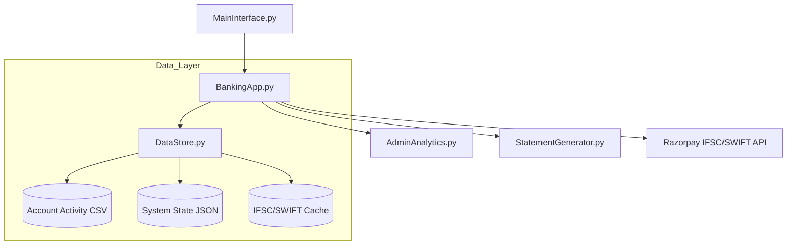

# 🏦 Scala Bank – Python Banking System v7.5

**Scala Bank** is a high-fidelity, enterprise-level banking simulation system. It bridges the gap between simple CLI scripts and complex financial software, featuring a custom time-simulation engine, real-world tax modules, and professional document generation.

[]()
[]()
[]()
[]()

---

## 🏗️ The Six Pillars of Scala Bank

The system is organized into six core "Enterprise Pillars," each handling a critical dimension of modern banking.

### 📊 Pillar 1: Professional Admin Analytics Dashboard
The "Command Center" for bank managers, providing unprecedented visibility into the bank's financial health.
*   **Security Hardening**: Mandatory PIN change on first use with persistent credential storage.
*   **Metric Sections**:
    *   **Bank Overview**: Net Assets, Deposit-to-Loan ratios, and status distribution.
    *   **Revenue Insights**: Tracking income from AMB fees, SWIFT charges, and cheque bounce penalties (₹500/bounce).
    *   **Risk Management**: Real-time identification of "High Default Risk" loans and "Negative Balance" accounts.
    *   **Customer Metrics**: Demographic analysis (Age, City) and asset-per-customer distribution.
*   **Risk Scoring Engine**: A dynamic 0-100% risk score based on overdue loans, overdrafts, and credit card defaults.

### 🌍 Pillar 2: Global Banking & SWIFT Routing
A fully-featured international transfer engine supported by real-time lookups and multi-currency logic.
*   **Smart SWIFT Lookup**: Integrated with the **Razorpay IFSC API** to automatically pull branch-specific SWIFT/BIC codes (e.g., `HDFCINBB`) during domestic IFSC validation.
*   **Official Bank Identity**: Scala Bank's internal identity is registered under SWIFT code `SCALAINBB`.
*   **Multi-Currency Engine**: Support for 10+ currencies (USD, EUR, GBP, AED, etc.) with dynamic exchange rate conversion and tiered SWIFT charges.
*   **International Registry**: A comprehensive database of foreign banks and accounts for seamless wire transfers.

### 💸 Pillar 3: Domestic External Transactor
High-performance domestic transfer system for NEFT, RTGS, and IMPS.
*   **IFSC Validation**: Real-time validation via Razorpay API with a robust **Local Caching Layer** for offline resilience.
*   **Beneficiary Management**: Securely store and manage recipients with auto-detected bank names and branches.
*   **Limit Enforcement**: Strict adherence to NEFT (up to ₹2L) and RTGS (min ₹2L) limits with time-based processing simulation.

### 📄 Pillar 4: Professional Artifacts & Reporting
Transitioned from legacy text files to a premium, branded PDF generation system powered by `fpdf2`.
*   **Statement of Accounts (SoA)**: High-fidelity PDFs for Loans (Amortization), Fixed Deposits, and Recurring Deposits.
*   **Official Certificates**: Branded "No Objection Certificates" (NOC) for account/card closures and official Tax Acknowledgements.
*   **Financial Reports**: Form 16 (TDS Certificate) and Form 26AS (Tax Credit Statement) with official layouts.
*   **Design Standards**: Features zebra-striped tables, dark blue Scala Bank headers, and unique timestamped security watermarks.

### 📑 Pillar 5: Comprehensive Tax Ecosystem (ITR)
A complete "Income Tax Department" simulation integrated into the banking core.
*   **Auto-Deduction Detection**: Scans transactions to detect 80C (PPF/ELSS), 80D (Insurance), Section 24 (Home Loan Interest), and HRA.
*   **ITR Filing Workflow**: End-to-end filing from PAN registration to refund processing.
*   **Refund Engine**: Automatic calculation and direct credit of tax refunds to savings accounts with integrated audit logs.

### 💰 Pillar 6: Investment & Credit Lifecycle
Advanced wealth management and credit evaluation tools.
*   **Fixed & Recurring Deposits**: Flexible tenures, interest projection, and OTP-based **RD Authorizations** for multi-party payments.
*   **Loan Lifecycle**: Automated approval based on **CIBIL 2.0 scores**, with NACH auto-debit integration for EMIs.
*   **CIBIL 2.0**: Weighted scoring (300-900) factoring in repayment history, utilization, and the impact of cheque bounces.

---

## ⚙️ Technical Deep Dive

### System Architecture


### Key Technical Highlights
*   **The BankClock™ Engine**: A custom time-simulation engine that triggers recurring bills, interest, and penalties as you fast-forward time.
*   **Lazy Loading Strategy**: Transactions are loaded into memory only when needed, ensuring the app remains fast even with 10,000+ records.
*   **Atomic Persistence**: Uses a "temp-save-rename" strategy to prevent data corruption during unexpected crashes.
*   **Luhn & Amortization**: Implements the Luhn algorithm for card validation and standard amortization formulas for loan schedules.

---

## 🚀 Installation & Setup

1.  **Requirements**: Python 3.13+
2.  **Install Dependencies**:
    ```bash
    pip install fpdf2
    ```
3.  **Launch**:
    ```bash
    python MainInterface.py
    ```

---

---

## 💻 Usage (Quick Guide)

| Action                       | Path                                                   |
| ---------------------------- | ------------------------------------------------------ |
| Create Account               | Main Menu → Open New Account                           |
| **View Transaction History** | **Account Menu → View Transaction History**            |
| **Filter by Type**           | **History Menu → Deposits/Withdrawals/SWIFT**          |
| **Download PDF Receipt**     | **History Menu → Select Transaction → View Receipt**   |
| Set Salary                   | Manage Salary → Configure Salary                       |
| **Register PAN**             | **Tax Planning → Register/Update PAN**                 |
| **View Form 16 (PDF)**       | **Tax Planning → Generate Form 16 (TDS Certificate)**  |
| **View Form 26AS (PDF)**     | **Tax Planning → View Form 26AS (Tax Credit)**         |
| **File ITR**                 | **Tax Planning → File Income Tax Return**              |
| **Process Tax Refund**       | **Tax Planning → ITR History → Process Refund**        |
| Apply Credit Card            | Card Management → Apply                                |
| **Close Card (PDF NOC)**     | **Card Management → Terminate Card**                   |
| Open Fixed Deposit           | Investment → Fixed Deposit                             |
| Start Recurring Deposit      | Investment → Recurring Deposit                         |
| **Export RD SoA (PDF)**      | **Investment → View RD Statement → Export**            |
| **International Transfer**   | **Transfers → International (SWIFT/Wire)**             |
| **Verify IFSC/SWIFT**        | **Transfers → Add Beneficiary (Auto-API Lookup)**      |
| **Close Account (PDF NOC)**  | **Account Services → Close Account**                   |
| **Admin Dashboard**          | **Main Menu → Admin Dashboard (PIN Required)**         |
| Simulate Time                | Fast Forward → Select Days/Months                      |

---

## 📁 Project Structure

| Layer          | Files                                                                              | Responsibilities                                      |
| -------------- | ---------------------------------------------------------------------------------- | ----------------------------------------------------- |
| Core Banking   | Account, Bank, Customer, AccountClosure                                            | Accounts, balance, KYC, closures                      |
| Transactions   | Transaction, TransactionRegistry, DataStore                                        | Transaction types, classification, persistence        |
| **Tax System** | **ITRFiling, TaxCalculator, TaxDeductionAnalyzer, Form16, Form26AS**               | **ITR filing, tax computation, deduction tracking**   |
| Cards          | Card, CreditEvaluator, CreditLimitEnhancement, RewardPointsManager                 | Debit/Credit card engine & rewards                    |
| Credit/Loans   | CIBIL, LoanEvaluator, loan, ClosureFormalities                                     | Score, approval & closures                            |
| Investments    | FixedDeposit, RecurringDeposit, RDAuthorization, RDStatement                       | FD/RD management, auth & statements                   |
| **Analytics**  | **AdminAnalytics, AdminControlPanel**                                              | **Management dashboard, revenue & risk reporting**    |
| **Document**   | **StatementGenerator**                                                             | **High-fidelity PDF rendering (FPDF2)**               |
| Automation     | RecurringBill, SalaryProfile, ExpenseSimulator, NachIdGenerator                    | Auto-pay, spending & NACH                             |
| Infrastructure | BankClock, DataStore, Serializers, PasswordRecovery                                | Time, persistence, auditing & security                |
| UI             | BankingApp, MainInterface                                                          | CLI menus & user interface                            |

---

## 🧪 Testing & Quality Assurance

### Test Suite Coverage
The system includes **60+ comprehensive test cases** covering:
- **Integration Tests**: Data persistence (`DataStore`), FD/RD workflows, and Beneficiary management.
- **Feature Tests**: Autopay logic, Credit enhancement, and International SWIFT transfers.
- **Document Tests**: PDF generation integrity and artifact path validation.
- **Security Tests**: Admin PIN encryption and password recovery flows.
- **API Tests**: Razorpay IFSC/SWIFT lookup resilience and caching.

### Running Tests
```bash
cd tests
python run_all_tests.py          # Run complete test suite
```

---

## 🚀 Quick Start Guide

### First Time Setup
1. **Clone and Run**
   ```bash
   git clone https://github.com/kv-techie/Python-Bank.git
   cd Python-Bank/backend
   pip install fpdf2
   python MainInterface.py
   ```

2. **Onboard as Admin**
   - Select "Admin Dashboard" (PIN: `1234`)
   - **Mandatory**: Change your PIN on first use to secure the system.

3. **Onboard as Customer**
   - Create account → Set salary (₹3,50,000/mo) → Register PAN (ABCDE1234F).
   - Fast-forward time by 1 month to see automated credits and bill processing.

### Sample Workflow: The "Refund Master"
```
1. Set High Salary → Register PAN
2. Fast forward 12 months (Accrue TDS)
3. Open Home Loan (Section 24 Deduction)
4. File ITR → System auto-detects deductions
5. Process Refund → View professional PDF Acknowledgment
```

---

## 🔮 Future Roadmap
*   [x] **v7.5**: Professional PDF Migration & Smart SWIFT Lookup.
*   [ ] **v8.0**: SQLite/PostgreSQL transition for industrial-grade persistence.
*   [ ] **v8.5**: Argon2/Bcrypt password hashing for customer security.
*   [ ] **v9.0**: REST API & Web Dashboard integration.


---

## 👨‍💻 Developer
**Kedhar Vinod** | [GitHub: @kv-techie](https://github.com/kv-techie)
🧑‍🎓 Jain (Deemed-to-be) University, Bengaluru

---
*Copyright © 2026 Scala Bank Simulation. All rights reserved.*
