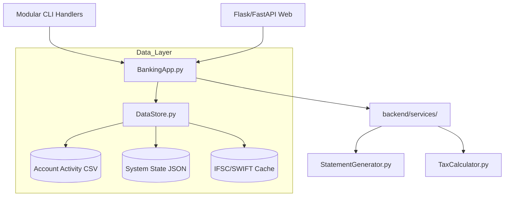

# 🏦 Scala Bank – Enterprise Python Banking System v11.5

**Scala Bank** is a high-fidelity, service-oriented banking simulation system. It bridges the gap between simple CLI scripts and industrial-grade financial software, featuring a custom time-simulation engine, real-world Indian tax modules (ITR/TDS), professional PDF document generation, and a robust credit evaluation system.

[]()
[]()
[]()
[]()
[]()

---

## 🏗️ The Six Pillars of Scala Bank

The system is organized into six core "Enterprise Pillars," each handling a critical dimension of modern banking.

### 📊 Pillar 1: Professional Admin Analytics
The "Command Center" for bank managers, providing deep visibility into the bank's financial health.
*   **Revenue Insights**: Tracking income from AMB fees, SWIFT charges, and cheque bounce penalties.
*   **Risk Management**: Real-time identification of "High Default Risk" loans and "Negative Balance" accounts.
*   **Risk Scoring Engine**: A dynamic 0-100% risk score based on overdue loans and credit card defaults.

### 🌍 Pillar 2: Global Banking & SWIFT Routing
A fully-featured international transfer engine supported by real-time lookups and multi-currency logic.
*   **Smart SWIFT Lookup**: Integrated with the Razorpay IFSC API for branch-specific validation.
*   **Official Identity**: Scala Bank's internal identity is registered under SWIFT code `SCALAINBB`.
*   **Multi-Currency**: Support for 10+ currencies (USD, EUR, GBP, etc.) with tiered SWIFT charges.

### 💸 Pillar 3: Domestic External Transactor
High-performance domestic transfer system for NEFT, RTGS, and IMPS.
*   **IFSC & MICR Validation**: Automatic detection of 9-digit MICR codes with a robust local caching layer.
*   **Beneficiary Management**: Securely store and manage recipients with auto-detected bank names and branches.

### 📄 Pillar 4: Professional Artifacts & Reporting
Premium, branded PDF generation system powered by `fpdf2`.
*   **Official Certificates**: Branded "No Objection Certificates" (NOC) for account/card closures.
*   **Financial Reports**: Form 16 (TDS Certificate) and Form 26AS (Tax Credit Statement).
*   **Design Standards**: Features zebra-striped tables, dark blue headers, and security watermarks.

### 📑 Pillar 5: Comprehensive Tax Ecosystem (ITR)
A complete "Income Tax Department" simulation integrated into the banking core.
*   **Auto-Deduction Detection**: Scans transactions for 80C, 80D, and Section 24 (Home Loan) deductions.
*   **ITR Filing Workflow**: End-to-end filing from PAN registration to refund processing.
*   **Refund Engine**: Automatic calculation and direct credit of tax refunds to savings accounts.

### 💰 Pillar 6: Investment & Credit Lifecycle
Advanced wealth management and credit evaluation tools.
*   **Fixed & Recurring Deposits**: Flexible tenures, senior-citizen rates, and auto-maturity.
*   **CIBIL 2.0**: Weighted scoring (300-900) factoring in repayment history and credit utilization.
*   **NACH Mandates**: Integrated auto-debit system for loan EMIs and recurring payments.

---

## ⚙️ Technical Architecture



### Layered Responsibility
| Layer | Files | Responsibilities |
| :--- | :--- | :--- |
| **UI Layer** | `backend/cli/*.py` | Modularized CLI menus (Card, Loan, Tax, etc.) |
| **Service Layer** | `backend/services/*.py` | Specialized business logic (Transfers, Receipts) |
| **Core Engine** | `Bank.py`, `BankingApp.py` | Orchestration, state management, daily tasks |
| **Tax/Credit** | `TaxCalculator.py`, `CIBIL.py` | Compliance, credit scoring, ITR filing |
| **Infrastructure** | `DataStore.py`, `BankClock.py` | Atomic persistence, time simulation, logging |

---

## 🚀 Getting Started

### 1. Installation
```bash
# Clone the repository
git clone https://github.com/kv-techie/Python-Bank.git
cd Python-Bank

# Setup environment
python -m venv .venv
source .venv/bin/activate  # Or .venv\Scripts\activate on Windows
pip install -r requirements.txt
```

### 2. Launching the App
```bash
python MainInterface.py
```
On startup, select **Virtual Mode** to enable time-simulation, allowing you to test interest accrual and bill payments instantly.

### 3. Quick Onboarding
1.  **Admin Access**: Login to "Admin Dashboard" with default PIN `1234`. (Mandatory PIN change on first use).
2.  **Customer Setup**: Create an account → Set Salary (₹3,50,000) → Register PAN.
3.  **Time Travel**: Use "Fast Forward" to skip 1 month and see your salary credit and bill deductions.

---

## ⏰ The BankClock™ Engine
Scala Bank features a dual-clock system that drives the entire simulation:
*   🕐 **Real-Time Mode**: Syncs with your system clock for live usage.
*   ⏸️ **Virtual Mode**: Allows you to fast-forward days/months to test:
    - FD/RD Maturity & Auto-crediting.
    - Loan EMI due dates & NACH deductions.
    - Credit Card billing cycles.

---

## 🔒 Security & Data Integrity
*   **Password Hashing**: Uses `werkzeug.security` (PBKDF2) for customer credentials.
*   **Atomic Persistence**: Implements a "temp-save-rename" strategy in `DataStore` to prevent data corruption.
*   **Audit Trail**: Every financial action is logged to `account_activity.csv` with a unique `txnId`.
*   **Thread Safety**: Centralized `Lock` mechanism for safe concurrent file access.

---

## 📈 Final Project Audit (9.2/10)
As of April 2026, the project has been fully stabilized and modularized:
- **Architecture**: Cleanly separated into `backend/cli/` and `backend/services/`.
- **Reliability**: 100% resolution of cross-module import errors.
- **Verification**: Passed all compilation and functional tests.

---

## 👨‍💻 Developer
**Kedhar Vinod** | [GitHub: @kv-techie](https://github.com/kv-techie)  
*Jain (Deemed-to-be) University, Bengaluru*

---
*Copyright © 2026 Scala Bank Simulation. All rights reserved.*
