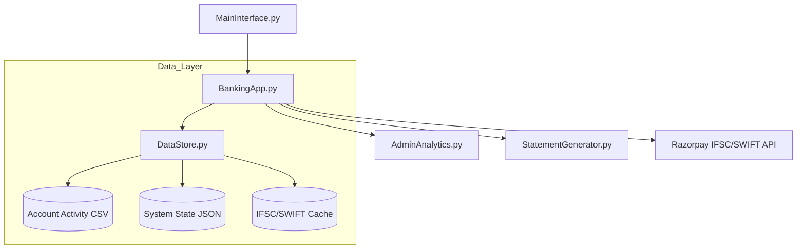

<<<<<<< HEAD
# 🏦 Scala Bank – Python Banking System v7.5

**Scala Bank** is a high-fidelity, enterprise-level banking simulation system. It bridges the gap between simple CLI scripts and complex financial software, featuring a custom time-simulation engine, real-world tax modules, and professional document generation.

[]()
[]()
[]()
[]()
=======
# 🏦 Scala Bank — Python Edition

> A feature-rich, fully object-oriented banking simulation system built in Python, complete with account management, loans, deposits, international transfers, tax modules, and much more.
>>>>>>> dad0800a7b9d066b1d585159e538cd831773bd22

---

## 🏗️ The Six Pillars of Scala Bank

<<<<<<< HEAD
The system is organized into six core "Enterprise Pillars," each handling a critical dimension of modern banking.

### 📊 Pillar 1: Professional Admin Analytics Dashboard
The "Command Center" for bank managers, providing unprecedented visibility into the bank's financial health.
*   **Security Hardening**: Mandatory PIN change on first use with persistent credential storage.
*   **Metric Sections**:
    *   **Bank Overview**: Net Assets, Deposit-to-Loan ratios, and status distribution.
    *   **Revenue Insights**: Tracking income from AMB fees, SWIFT charges, and cheque bounce penalties (₹500/bounce).
    *   **Risk Management**: Real-time identification of "High Default Risk" loans and "Negative Balance" accounts.
    *   **Customer Metrics**: Demographic analysis (Age, City) and asset-per-customer distribution.
*   **Risk Scoring Engine**: A dynamic 0-100% risk score based on overdue loans, overdrafts, and credit card defaults.

### 🌍 Pillar 2: Global Banking & SWIFT Routing
A fully-featured international transfer engine supported by real-time lookups and multi-currency logic.
*   **Smart SWIFT Lookup**: Integrated with the **Razorpay IFSC API** to automatically pull branch-specific SWIFT/BIC codes (e.g., `HDFCINBB`) during domestic IFSC validation.
*   **Official Bank Identity**: Scala Bank's internal identity is registered under SWIFT code `SCALAINBB`.
*   **Multi-Currency Engine**: Support for 10+ currencies (USD, EUR, GBP, AED, etc.) with dynamic exchange rate conversion and tiered SWIFT charges.
*   **International Registry**: A comprehensive database of foreign banks and accounts for seamless wire transfers.

### 💸 Pillar 3: Domestic External Transactor
High-performance domestic transfer system for NEFT, RTGS, and IMPS.
*   **IFSC Validation**: Real-time validation via Razorpay API with a robust **Local Caching Layer** for offline resilience.
*   **Beneficiary Management**: Securely store and manage recipients with auto-detected bank names and branches.
*   **Limit Enforcement**: Strict adherence to NEFT (up to ₹2L) and RTGS (min ₹2L) limits with time-based processing simulation.

### 📄 Pillar 4: Professional Artifacts & Reporting
Transitioned from legacy text files to a premium, branded PDF generation system powered by `fpdf2`.
*   **Statement of Accounts (SoA)**: High-fidelity PDFs for Loans (Amortization), Fixed Deposits, and Recurring Deposits.
*   **Official Certificates**: Branded "No Objection Certificates" (NOC) for account/card closures and official Tax Acknowledgements.
*   **Financial Reports**: Form 16 (TDS Certificate) and Form 26AS (Tax Credit Statement) with official layouts.
*   **Design Standards**: Features zebra-striped tables, dark blue Scala Bank headers, and unique timestamped security watermarks.

### 📑 Pillar 5: Comprehensive Tax Ecosystem (ITR)
A complete "Income Tax Department" simulation integrated into the banking core.
*   **Auto-Deduction Detection**: Scans transactions to detect 80C (PPF/ELSS), 80D (Insurance), Section 24 (Home Loan Interest), and HRA.
*   **ITR Filing Workflow**: End-to-end filing from PAN registration to refund processing.
*   **Refund Engine**: Automatic calculation and direct credit of tax refunds to savings accounts with integrated audit logs.

### 💰 Pillar 6: Investment & Credit Lifecycle
Advanced wealth management and credit evaluation tools.
*   **Fixed & Recurring Deposits**: Flexible tenures, interest projection, and OTP-based **RD Authorizations** for multi-party payments.
*   **Loan Lifecycle**: Automated approval based on **CIBIL 2.0 scores**, with NACH auto-debit integration for EMIs.
*   **CIBIL 2.0**: Weighted scoring (300-900) factoring in repayment history, utilization, and the impact of cheque bounces.

---

## ⚙️ Technical Deep Dive

### System Architecture


### Key Technical Highlights
*   **The BankClock™ Engine**: A custom time-simulation engine that triggers recurring bills, interest, and penalties as you fast-forward time.
*   **Lazy Loading Strategy**: Transactions are loaded into memory only when needed, ensuring the app remains fast even with 10,000+ records.
*   **Atomic Persistence**: Uses a "temp-save-rename" strategy to prevent data corruption during unexpected crashes.
*   **Luhn & Amortization**: Implements the Luhn algorithm for card validation and standard amortization formulas for loan schedules.

---

## 🚀 Installation & Setup

1.  **Requirements**: Python 3.13+
2.  **Install Dependencies**:
    ```bash
    pip install fpdf2
    ```
3.  **Launch**:
    ```bash
    python MainInterface.py
    ```

---

---
=======
- [Overview](#overview)
- [Features at a Glance](#features-at-a-glance)
- [Getting Started](#getting-started)
- [Project Structure](#project-structure)
- [Module Reference](#module-reference)
  - [Core Engine](#core-engine)
  - [Account & Customer](#account--customer)
  - [Transactions & Transfers](#transactions--transfers)
  - [Cards & Credit](#cards--credit)
  - [Deposits (FD & RD)](#deposits-fd--rd)
  - [Loans](#loans)
  - [Cheques](#cheques)
  - [International Banking](#international-banking)
  - [Tax & Compliance](#tax--compliance)
  - [Utilities & Automation](#utilities--automation)
- [Data Persistence](#data-persistence)
- [Clock Modes](#clock-modes)
- [Sample Output](#sample-output)

---

## Overview

**Scala Bank - Python Edition** is a comprehensive, terminal-based banking application that simulates a real-world banking ecosystem. It is built using pure Python with an object-oriented architecture, supporting a wide range of banking operations such as account management, multi-type deposits, loans with EMI automation, debit/credit cards with reward points, cheque issuance, international wire transfers, NACH mandates, and Indian tax compliance tools (Form 16, Form 26AS, ITR Filing).

All data is persisted to **JSON files** through a centralized `DataStore` layer, making the system stateful across sessions.

---

## Features at a Glance

| Category | Capabilities |
|---|---|
| 👤 Customers | Registration, authentication, profile management, account locking |
| 🏦 Accounts | Savings, Current, Future (minor) accounts; multi-account support per customer |
| 💸 Transactions | Deposits, withdrawals, NEFT, RTGS, inter-account transfers |
| 💳 Cards | Debit & credit card issuance, credit limit evaluation, reward points |
| 📈 Fixed Deposits | Create FDs, senior-citizen rates, auto-maturity crediting |
| 🔁 Recurring Deposits | RD creation, autopay, cross-account authorization via OTP |
| 🏠 Loans | Personal/home loans, CIBIL evaluation, EMI scheduler, NACH mandates |
| 🧾 Cheques | Cheque issuance, cheque book management, cheque-based transfers |
| 🌍 International | SWIFT/IBAN registry, international wire transfers |
| 📋 Tax & Compliance | CIBIL score, Form 16, Form 26AS, ITR Filing, Tax Deduction Analyzer |
| ⏰ Clock Modes | Real-time & virtual clock for testing time-based automation |
| 🔒 Security | Password recovery, account locking, OTP-based authorization |
| 🔄 Automation | Daily task processor: salary credit, RD autopay, FD maturity, credit card bills |

---

## Getting Started

### Prerequisites

- Python **3.8+**
- No third-party libraries required — uses Python's standard library only

### Installation

```bash
# Clone the repository
git clone https://github.com/kv-techie/Python-Bank.git
cd Python-Bank
```

### Running the Application

```bash
cd backend
python MainInterface.py
```

On startup, you will be prompted to select a **Clock Mode**:
>>>>>>> dad0800a7b9d066b1d585159e538cd831773bd22

```
============================================================
           SCALA BANK - CLOCK MODE SELECTION
============================================================

<<<<<<< HEAD
| Action                       | Path                                                   |
| ---------------------------- | ------------------------------------------------------ |
| Create Account               | Main Menu → Open New Account                           |
| **View Transaction History** | **Account Menu → View Transaction History**            |
| **Filter by Type**           | **History Menu → Deposits/Withdrawals/SWIFT**          |
| **Download PDF Receipt**     | **History Menu → Select Transaction → View Receipt**   |
| Set Salary                   | Manage Salary → Configure Salary                       |
| **Register PAN**             | **Tax Planning → Register/Update PAN**                 |
| **View Form 16 (PDF)**       | **Tax Planning → Generate Form 16 (TDS Certificate)**  |
| **View Form 26AS (PDF)**     | **Tax Planning → View Form 26AS (Tax Credit)**         |
| **File ITR**                 | **Tax Planning → File Income Tax Return**              |
| **Process Tax Refund**       | **Tax Planning → ITR History → Process Refund**        |
| Apply Credit Card            | Card Management → Apply                                |
| **Close Card (PDF NOC)**     | **Card Management → Terminate Card**                   |
| Open Fixed Deposit           | Investment → Fixed Deposit                             |
| Start Recurring Deposit      | Investment → Recurring Deposit                         |
| **Export RD SoA (PDF)**      | **Investment → View RD Statement → Export**            |
| **International Transfer**   | **Transfers → International (SWIFT/Wire)**             |
| **Verify IFSC/SWIFT**        | **Transfers → Add Beneficiary (Auto-API Lookup)**      |
| **Close Account (PDF NOC)**  | **Account Services → Close Account**                   |
| **Admin Dashboard**          | **Main Menu → Admin Dashboard (PIN Required)**         |
| Simulate Time                | Fast Forward → Select Days/Months                      |
=======
Select Clock Mode:
1. 🕐 Real-Time Mode (Syncs with your device clock)
2. ⏸️  Virtual Mode (Manual time control for testing)
```

> **Tip:** Use **Virtual Mode** to test time-sensitive features like FD/RD maturity, loan EMI schedules, and salary crediting without waiting for real time to pass.
>>>>>>> dad0800a7b9d066b1d585159e538cd831773bd22

### Optional: Set Up Database Indexes

<<<<<<< HEAD
## 📁 Project Structure

| Layer          | Files                                                                              | Responsibilities                                      |
| -------------- | ---------------------------------------------------------------------------------- | ----------------------------------------------------- |
| Core Banking   | Account, Bank, Customer, AccountClosure                                            | Accounts, balance, KYC, closures                      |
| Transactions   | Transaction, TransactionRegistry, DataStore                                        | Transaction types, classification, persistence        |
| **Tax System** | **ITRFiling, TaxCalculator, TaxDeductionAnalyzer, Form16, Form26AS**               | **ITR filing, tax computation, deduction tracking**   |
| Cards          | Card, CreditEvaluator, CreditLimitEnhancement, RewardPointsManager                 | Debit/Credit card engine & rewards                    |
| Credit/Loans   | CIBIL, LoanEvaluator, loan, ClosureFormalities                                     | Score, approval & closures                            |
| Investments    | FixedDeposit, RecurringDeposit, RDAuthorization, RDStatement                       | FD/RD management, auth & statements                   |
| **Analytics**  | **AdminAnalytics, AdminControlPanel**                                              | **Management dashboard, revenue & risk reporting**    |
| **Document**   | **StatementGenerator**                                                             | **High-fidelity PDF rendering (FPDF2)**               |
| Automation     | RecurringBill, SalaryProfile, ExpenseSimulator, NachIdGenerator                    | Auto-pay, spending & NACH                             |
| Infrastructure | BankClock, DataStore, Serializers, PasswordRecovery                                | Time, persistence, auditing & security                |
| UI             | BankingApp, MainInterface                                                          | CLI menus & user interface                            |

---

## 🧪 Testing & Quality Assurance

### Test Suite Coverage
The system includes **60+ comprehensive test cases** covering:
- **Integration Tests**: Data persistence (`DataStore`), FD/RD workflows, and Beneficiary management.
- **Feature Tests**: Autopay logic, Credit enhancement, and International SWIFT transfers.
- **Document Tests**: PDF generation integrity and artifact path validation.
- **Security Tests**: Admin PIN encryption and password recovery flows.
- **API Tests**: Razorpay IFSC/SWIFT lookup resilience and caching.

### Running Tests
```bash
cd tests
python run_all_tests.py          # Run complete test suite
```

---

## 🚀 Quick Start Guide

### First Time Setup
1. **Clone and Run**
   ```bash
   git clone https://github.com/kv-techie/Python-Bank.git
   cd Python-Bank/backend
   pip install fpdf2
   python MainInterface.py
   ```

2. **Onboard as Admin**
   - Select "Admin Dashboard" (PIN: `1234`)
   - **Mandatory**: Change your PIN on first use to secure the system.

3. **Onboard as Customer**
   - Create account → Set salary (₹3,50,000/mo) → Register PAN (ABCDE1234F).
   - Fast-forward time by 1 month to see automated credits and bill processing.

### Sample Workflow: The "Refund Master"
```
1. Set High Salary → Register PAN
2. Fast forward 12 months (Accrue TDS)
3. Open Home Loan (Section 24 Deduction)
4. File ITR → System auto-detects deductions
5. Process Refund → View professional PDF Acknowledgment
=======
For optimized data lookup on large datasets, run the index creation script:

```bash
python create_indexes.py
```

### Optional: Migrate Timestamps

If migrating data from an older version of the app:

```bash
python migrate_timestamps.py
>>>>>>> dad0800a7b9d066b1d585159e538cd831773bd22
```

---

<<<<<<< HEAD
## 🔮 Future Roadmap
*   [x] **v7.5**: Professional PDF Migration & Smart SWIFT Lookup.
*   [ ] **v8.0**: SQLite/PostgreSQL transition for industrial-grade persistence.
*   [ ] **v8.5**: Argon2/Bcrypt password hashing for customer security.
*   [ ] **v9.0**: REST API & Web Dashboard integration.


---

## 👨‍💻 Developer
**Kedhar Vinod** | [GitHub: @kv-techie](https://github.com/kv-techie)
🧑‍🎓 Jain (Deemed-to-be) University, Bengaluru

---
*Copyright © 2026 Scala Bank Simulation. All rights reserved.*
=======
## Project Structure

| Layer | Files | Responsibilities |
|---|---|---|
| 🏦 Core Banking | `Account`, `Bank`, `Customer`, `AccountClosure`, `ClosureFormalities` | Accounts, balance, KYC, closures |
| 💸 Transactions | `Transaction`, `TransactionRegistry`, `Beneficiary`, `verify_transfer` | Transaction types, classification, beneficiary management |
| 📊 Tax System | `ITRFiling`, `TaxCalculator`, `TaxDeductionAnalyzer`, `TaxExemption`, `Form16`, `Form26AS` | ITR filing, tax computation, deduction tracking |
| 💳 Cards | `Card`, `CreditEvaluator`, `CreditLimitEnhancement`, `RewardPointsManager` | Debit/Credit card engine & rewards |
| 🧾 Credit & Loans | `CIBIL`, `LoanEvaluator`, `loan`, `LoanNachMandate`, `NachIdGenerator` | Score, approval, EMI & NACH mandates |
| 📈 Investments | `FixedDeposit`, `RecurringDeposit`, `RDAuthorization`, `RDStatement` | FD/RD management, auth & statements |
| 📓 Cheques | `Cheque`, `ChequeBook` | Cheque issuance & book management |
| 🌍 International | `InternationalTransfer`, `InternationalBankRegistry`, `AddNewIntlAccounts` | Cross-border transactions |
| 🔄 Automation | `RecurringBill`, `SalaryProfile`, `ExpenseSimulator`, `NachIdGenerator` | Auto-pay, spending simulation & NACH |
| 🛠️ Infrastructure | `BankClock`, `DataStore`, `Serializers`, `PasswordRecovery`, `create_indexes`, `migrate_timestamps` | Time, persistence, auditing & security |
| 🖥️ UI | `BankingApp`, `MainInterface` | CLI menus & user interface |

---

## Module Reference

### Core Engine

#### `MainInterface.py`
The application entry point. Prompts the user to select a **Clock Mode** (Real-Time or Virtual), then launches `BankingApp`.

#### `BankingApp.py`
The main application loop — contains all user-facing menus and orchestrates interactions between the UI and the `Bank` core. This is the largest module (~280 KB) and coordinates every feature of the system.

#### `Bank.py`
The central **Bank class** that manages all entities:
- Customer & account registration and authentication
- Loan lifecycle: evaluate → approve → disburse → EMI payments
- FD & RD creation, autopay processing, and maturity handling
- Credit card issuance with dynamic limit calculation
- **Daily automated task processor**: salary crediting, recurring bill deductions, RD autopay, FD/RD maturity events

#### `DataStore.py`
A static utility class acting as the **persistence layer**. All objects are serialized to/from JSON files. Key methods:
- `load_accounts()` / `save_accounts()`
- `load_customers()` / `save_customers()`
- `load_loans()` / `save_loans()`
- `load_fixed_deposits()` / `save_fixed_deposits()`
- `load_recurring_deposits()` / `save_recurring_deposits()`
- `load_international_accounts()` / `save_international_accounts()`
- `append_activity()` — writes a transaction audit log entry

#### `BankClock.py`
A global clock abstraction supporting two modes (see [Clock Modes](#clock-modes)). All timestamps across the entire system use `BankClock.today()` and `BankClock.get_formatted_datetime()` to ensure consistent time management.

#### `Serializers.py`
Helpers for converting complex Python objects to/from JSON-serializable dictionaries, used internally by `DataStore`.

---

### Account & Customer

#### `Customer.py`
Represents a bank customer with fields: `customer_id`, `username`, `password`, `first_name`, `last_name`, `dob`, `gender`, `phone_number`, `email`, `cibil_score`, `salary`, `credit_cards`, and account linkage. Supports customer locking for security.

#### `Account.py`
Represents a bank account. Supports three account types:
- **Savings** — standard individual savings account
- **Current** — business/high-volume transactional account
- **Future** — minor/child savings account

Key features: balance management, full transaction history, salary profile linking, card attachment, recurring bill management, credit card bill processing, and minimum balance enforcement.

#### `PasswordRecovery.py`
Handles password reset flows including identity verification steps and secure password update.

#### `AccountClosure.py` & `ClosureFormalities.py`
Manages the full account closure workflow — from initiating a closure request and verifying pre-conditions (zero balance, no active loans/FDs), to completing the closure with a formal audit trail.

---

### Transactions & Transfers

#### `Transaction.py`
The `Transaction` entity records every financial event. Key fields:
- `id` — unique transaction ID
- `type` — e.g., `DEPOSIT`, `WITHDRAWAL`, `NEFT_SENT`, `RTGS_RECEIVED`, `LOAN_EMI`, `FD_OPENED`, `RD_OPENED`, `LOAN_CREDIT`
- `amount`, `resulting_balance`, `timestamp`
- `cheque_id` — set when the transaction is cheque-based
- `metadata` — free-form string for contextual data (loan ID, FD number, etc.)

#### `TransactionRegistry.py`
Maintains a global log and registry of all transactions across all accounts for audit and search purposes.

#### `Beneficiary.py`
Allows customers to save and manage **beneficiary accounts** for quick fund transfers, supporting both domestic and international beneficiaries.

#### `verify_transfer.py`
A utility script for manually verifying the integrity of a specific transfer — useful during debugging or post-transaction audits.

---

### Cards & Credit

#### `Card.py`
Defines two card types:
- **`DebitCard`** — linked directly to an account; used for withdrawals and purchases
- **`CreditCard`** — carries a credit limit, billing cycle, due dates, and outstanding balance tracking

#### `CreditEvaluator.py`
Calculates the credit limit for a new credit card based on: CIBIL score, annual income, age, existing debt, employer category, and whether the customer holds a salary account with the bank.

#### `CreditLimitEnhancement.py`
Handles the full workflow for requesting and processing a credit limit increase on an existing credit card.

#### `RewardPointsManager.py`
Tracks reward points earned from credit card transactions. Supports point redemption against outstanding bills or for cashback.

---

### Deposits (FD & RD)

#### `FixedDeposit.py`
Models a Fixed Deposit with:
- Principal amount, tenure (in months), and interest rate
- **Senior citizen rates** — additional interest for customers aged 60+
- Maturity amount calculation and maturity date tracking
- `MIN_AMOUNT` / `MAX_AMOUNT` validation
- Auto-maturity: principal + interest is automatically credited on the maturity date

#### `RecurringDeposit.py`
Models a Recurring Deposit with:
- Monthly installment, tenure, and interest rate
- **Autopay** — automatic debit on a configurable day each month
- Installment tracking (`installments_paid`, `total_deposited`, `payment_history`)
- Maturity amount calculated using compound interest formula

#### `RDAuthorization.py`
Enables **cross-account RD payments** — a third party (e.g., a parent) can authorize monthly payments for an RD held by another customer (e.g., their child). Uses an **OTP verification** flow to confirm and activate the authorization.

#### `RDStatement.py`
Generates a detailed statement for a Recurring Deposit, showing installment history, upcoming due dates, and the expected maturity value.

---

### Loans

#### `loan.py`
The `Loan` entity with fields: `loan_id`, `customer_id`, `principal`, `interest_rate`, `tenure_months`, `emis_paid`, `status`, `start_date`, `closure_date`, and `loan_type` (e.g., `PERSONAL`, `HOME`). Includes `calculate_emi()` using the standard reducing-balance EMI formula.

#### `LoanEvaluator.py`
Evaluates loan eligibility based on: customer CIBIL score, existing loan burden, income, requested amount, and tenure. Returns `(approved: bool, reason: str)`.

#### `LoanNachMandate.py`
Sets up **NACH (National Automated Clearing House) mandates** to auto-debit EMI amounts from a designated account on the EMI due date every month.

#### `NachIdGenerator.py`
Generates unique NACH mandate IDs for all loan autopay registrations.

---

### Cheques

#### `Cheque.py`
Represents a single cheque with fields for payee, amount, issue date, and status (Active / Cleared / Bounced / Cancelled).

#### `ChequeBook.py`
Manages a cheque book assigned to an account — tracks issued cheques, cheque book requests, and the number of available leaves remaining.

---

### International Banking

#### `InternationalBankRegistry.py`
A registry of international correspondent banks identified by **SWIFT codes** and supporting **IBAN** formats for multiple countries. Used to validate international transfer destinations.

#### `InternationalTransfer.py`
Processes international wire transfers — handles currency conversion, SWIFT routing, transfer limits, and fee deduction from the sender's account.

#### `AddNewIntlAccounts.py`
An administrative utility to onboard new international bank accounts or correspondents into the registry.

---

### Tax & Compliance

#### `CIBIL.py`
Models a customer's **CIBIL credit score**, which directly influences loan approvals, interest rates offered, and credit card limit calculations.

#### `TaxCalculator.py`
Calculates Indian **income tax** liability based on the customer's salary, investment declarations, and applicable tax slabs under both the Old and New Tax Regimes.

#### `TaxDeductionAnalyzer.py`
Analyzes available tax deductions under sections like **80C, 80D, HRA, LTA**, etc., and recommends strategies to optimize the customer's tax liability.

#### `TaxExemption.py`
Handles tax exemption declarations and calculates their impact on TDS computation for the financial year.

#### `SalaryProfile.py`
Linked to an account — stores employer name, monthly salary, and credit date configuration. Enables automatic salary crediting on a monthly schedule via the daily task processor.

#### `Form16.py`
Generates a **Form 16** (TDS certificate issued by employer) for a customer for a given financial year, based on salary and TDS data.

#### `Form26AS.py`
Generates a **Form 26AS** (consolidated annual tax statement) showing all tax credits, TDS deductions, and advance tax payments for a financial year.

#### `ITRFiling.py`
An **ITR (Income Tax Return) filing assistant** that compiles income from all sources, applicable deductions, tax payable/refundable, and guides the customer through the end-to-end filing process.

---

### Utilities & Automation

#### `RecurringBill.py`
Schedules and automatically processes recurring bill payments (e.g., utility bills, subscriptions, insurance premiums) linked to an account. Bills are deducted on their configured due date during the daily task run.

#### `ExpenseSimulator.py`
Simulates realistic expense patterns for development and testing purposes — generates synthetic transactions (purchases, ATM withdrawals, utility payments) across a configurable time range.

#### `create_indexes.py`
Sets up lookup indexes for accounts, customers, and transactions to significantly improve search and retrieval performance on large datasets.

#### `migrate_timestamps.py`
A one-time migration utility to convert legacy timestamp formats in stored JSON data to the current ISO 8601 standard used across the system.

---

## Data Persistence

All data is stored as **JSON files** in the local filesystem via `DataStore.py`. There is no external database dependency — making the project fully self-contained.

| Data Entity | Storage File |
|---|---|
| Customers | `customers.json` |
| Accounts | `accounts.json` |
| Transactions | Per-account transaction files |
| Loans | `loans.json` |
| Fixed Deposits | `fixed_deposits.json` |
| Recurring Deposits | `recurring_deposits.json` |
| RD Authorizations | `rd_authorizations.json` |
| International Accounts | `international_accounts.json` |
| Activity Audit Log | `activity_log.csv` |

All saves are triggered automatically after any state-changing operation. `Bank.save()` persists the full bank state and prints per-entity timing diagnostics, for example:

```
⏱️  Accounts saved in 0.03s
⏱️  Customers saved in 0.01s
⏱️  Loans saved in 0.01s
✅ Total save time: 0.07s
```

---

## Clock Modes

Scala Bank features a dual-clock system managed by `BankClock.py`:

| Mode | Description | Best For |
|---|---|---|
| 🕐 **Real-Time Mode** | Syncs with your device's system clock | Production / live demo usage |
| ⏸️ **Virtual Mode** | Manual time control — fast-forward days, weeks, or months | Testing time-sensitive automation |

Virtual Mode is especially useful for testing:
- RD/FD maturity and auto-crediting
- Loan EMI due dates and NACH deductions
- Monthly salary crediting
- Recurring bill and subscription deductions
- Credit card billing cycle generation

---

## Sample Output

```
============================================================
           SCALA BANK - CLOCK MODE SELECTION
============================================================

✅ Virtual Mode activated (Time simulation enabled)

Press Enter to continue...

==============================
       SCALA BANK MENU
==============================
[1] Login
[2] Register New Customer
[3] Admin Panel
[0] Exit

> Logged in as: Kedhar Vinod
> Account: ACC1001  | Type: Savings  | Balance: ₹1,25,000.00
> Loan ID: LOAN000001 | EMI: ₹4,523.00  | Paid: 3/36 | Status: Active
> FD Number: FD-00042  | Maturity Amount: ₹52,430.00 on 15-03-2026
> RD Number: RD-00011  | Monthly: ₹2,000.00 | Autopay: ON (Day 5)
```

---

## Author

**Kedhar Vinod** — [@kv-techie](https://github.com/kv-techie)

---

*Built with ❤️ using pure Python.*
>>>>>>> dad0800a7b9d066b1d585159e538cd831773bd22
